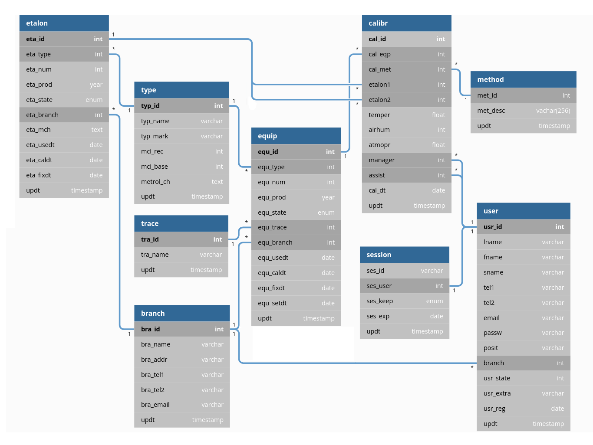

# Проект структури БД

## Передмова

### Про назви таблиць та полів

## Схема



<https://dbdiagram.io/> | [Код для побудови діаграми](dbdiagram_code)

## Опис

### equip

measuring EQUIPment - вимірювальне обладнання

```mysql
CREATE TABLE `equip` (
  `equ_id`    int PRIMARY KEY AUTO_INCREMENT,
  `equ_type`  int,
  `equ_numb`  int,
  `equ_prod`  year,
  `equ_state` enum,
  `equ_usedt` date,
  `equ_setdt` date,
  `equ_bran`  int,
  `equ_caldt` date,
  `equ_fixdt` date,
  `updt`      timestamp
);
```

| поле | опис |
| -----| ---- |
| `equ_id`     | id обладнання (unsigned int: up to 16_777_215) |
| `equ_type`   | id > назва обладнання, маркировка |
| `equ_num`    | заводський номер |
| `equ_prod`   | рік випуску |
| `equ_state`  | Основний/Резервний/Виведений з експлуатації |
| `equ_trace`  | простежуваність до еталону ? - тут, чи у equ? "traceability" |
| `equ_branch` | id метео-станції (замовник) |
| `equ_usedt`  | дата введення в експлуатацію |
| `equ_caldt`  | дата калібрування |
| `equ_fixdt`  | дата останнього ремонту |
| `equ_setdt`  | дата встановлення на метеостанцію |
| `updt`       | дата оновлення |


### session

Таблиця лише "живих" сесій. Також сесії (login/logout) синхронно записуються у лог-файл, де і залишаються назавжди.
`login` - записує сесію користувача у цю таблицю, `logout` - видаляє.

```mysql
CREATE TABLE session (
  `ses_id`     varchar(36),
  `ses_user`   smallint(5) unsigned,
  `ses_keep`   enum(1,2),
  `ses_exp`    date,
  `updt`       timestamp,
  UNIQUE (`ses_user`)
);
```
- **ses_id** - id сесії, `12002e8a-6043-4b56-a748-dcf141f7b88f`
Не unique - неймовірно, якщо співпаде, але якщо так, то все одно, вибираємо запис по користувачу

- **ses_user** - id користувача, починаємо від `1001`
unique, бо можлива лише одна сесія для одного користувача. Якщо користувач робить `login`, з іншого пристрою - його остання сесія видаляється.

- **ses_keep** - опція "запам'ятати мене", `0` - ні, `1` - так
При '1' продовжує строк дії сесії на тиждень при кожній перевірці сесії. Зкидується в '0' через тиждень неактивності або `logout`.

- **ses_exp** - дата до якої дійсна сесія, `2022-02-02`
якщо раніше не станеться `logout`, що видаляє сесію

- **updt** - час оновлення сесії, `2022-01-28 18:30:54`


### Таблиця 2

